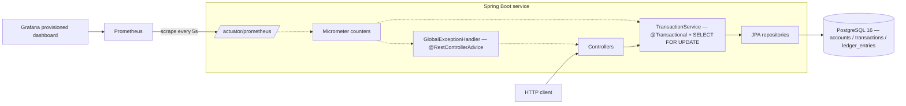
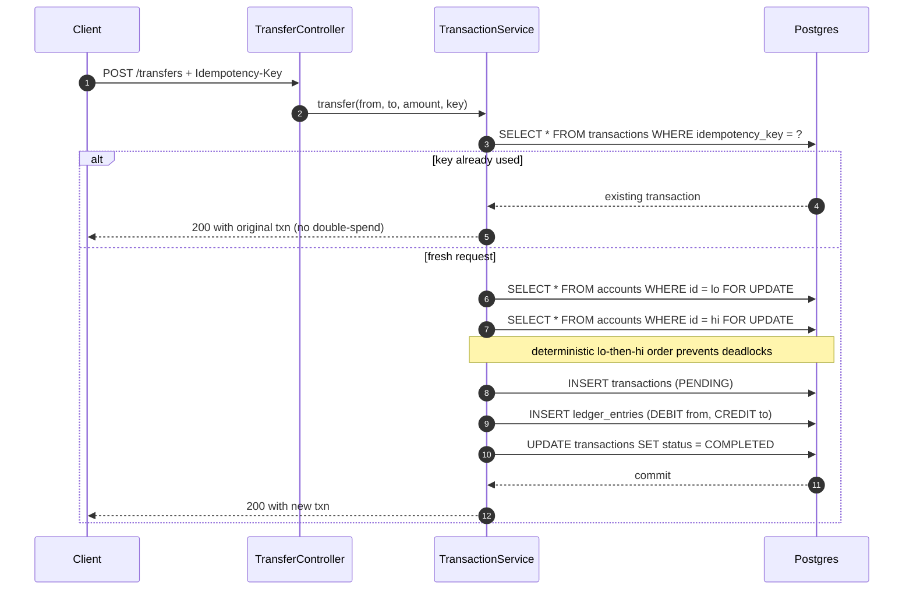
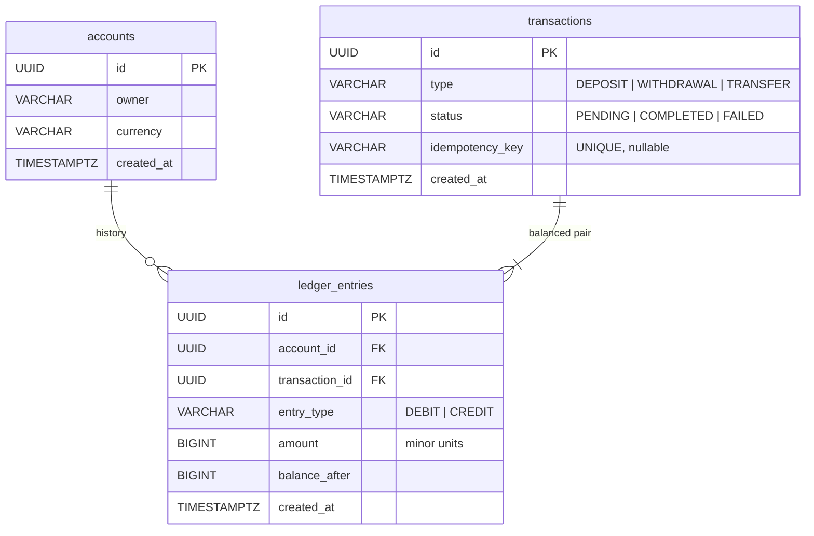
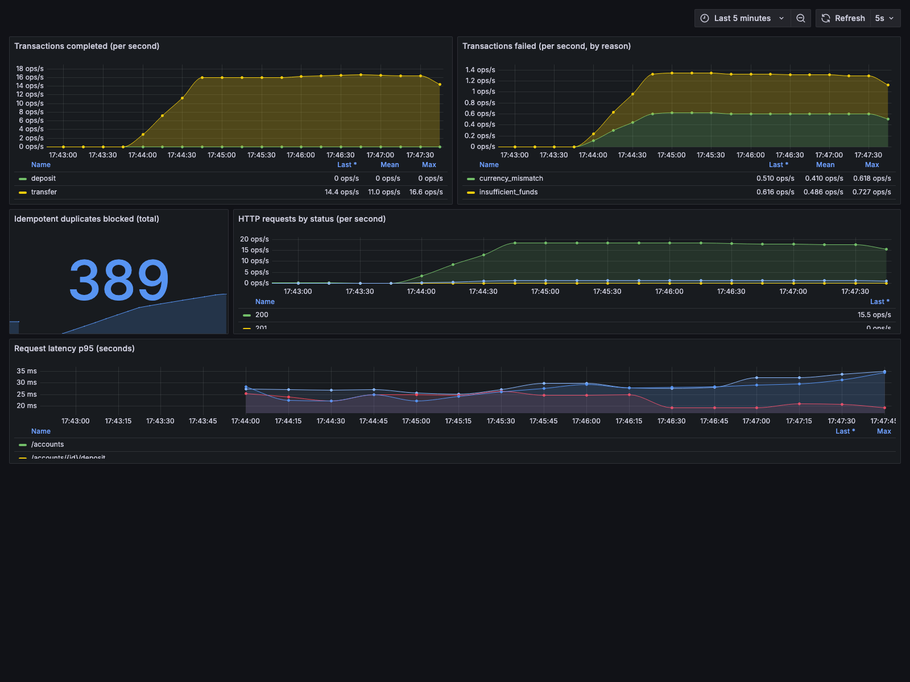

# banking-ledger

A double-entry banking ledger and payments service in Spring Boot 3 / Java 21 / PostgreSQL.

Built as a portfolio piece around the engineering problems that actually matter in money movement: correct accounting, concurrency-safe balance updates, idempotent retries, atomic transfers.

## Status

Phases 1–3 complete: domain layer, money movement endpoints, pessimistic-locking-based concurrency control, idempotency, Testcontainers-backed concurrency stress test, Micrometer instrumentation, and a provisioned Prometheus + Grafana stack. See `prompt.md` for the full brief.

## Concurrency proof

The headline test in `ConcurrentTransferStressTest` fires **1,000 concurrent transfers from a single source account** (20 threads × 50 transfers each) against a real Postgres via Testcontainers, and asserts the final balance is **exactly** correct — zero lost updates, zero double-spends. A second test runs 16 threads doing bidirectional A↔B transfers to verify the deterministic lock ordering prevents deadlocks.

## Architecture



### Transfer flow



### Domain



## Stack

Java 21 · Spring Boot 3.3 · Spring Data JPA · Spring Security · PostgreSQL 16 · Flyway · Lombok · MapStruct · springdoc-openapi · Micrometer + Prometheus + Grafana · JUnit 5 · Testcontainers.

## Running locally

```bash
docker compose up -d                 # postgres + prometheus + grafana
mvn spring-boot:run                  # the service itself
./ops/load.sh                        # optional: generate dashboard traffic
```

| What | Where |
|---|---|
| API | http://localhost:8080 |
| Swagger UI | http://localhost:8080/swagger-ui.html |
| Actuator | http://localhost:8080/actuator |
| Prometheus scrape | http://localhost:8080/actuator/prometheus |
| Prometheus UI | http://localhost:9090 |
| Grafana | http://localhost:3000 (anonymous viewer; admin/admin) |

## Observability

The service emits three custom Micrometer counters in addition to the default JVM / HTTP / DataSource metrics:

| Metric | Tags | Where it's incremented |
|---|---|---|
| `transactions_completed_total` | `type` ∈ {deposit, withdrawal, transfer} | service layer, after `status=COMPLETED` |
| `transactions_failed_total` | `reason` ∈ {insufficient_funds, currency_mismatch, bad_request} | `@RestControllerAdvice` |
| `idempotent_duplicates_blocked_total` | `type` | service layer, when the Idempotency-Key short-circuits |

The Grafana dashboard at `ops/grafana/dashboards/banking-ledger.json` is auto-provisioned and renders these as five panels: completed rate by type, failed rate by reason, blocked-duplicate counter, HTTP-status rates, and request-latency p95 by URI.



## Running tests

```bash
mvn verify
```

The Testcontainers tests spin up a real Postgres 16 container — no H2 cheating.

> **Local note for macOS Docker runtimes:** Docker 29 daemons (Colima, OrbStack) require API ≥ 1.40, but Testcontainers' shaded docker-java still negotiates 1.32. Colima additionally can't start the Testcontainers ryuk reaper under its default mount config. Both fixes are already wired into `pom.xml` via surefire env vars: `DOCKER_API_VERSION=1.43`, `DOCKER_HOST=unix://$HOME/.colima/default/docker.sock`, and `TESTCONTAINERS_RYUK_DISABLED=true`. No action needed; documenting because it cost an afternoon to root-cause. If you switch runtimes, `rm ~/.testcontainers.properties` to clear Testcontainers' cached strategy.

## Design decisions

- **Pessimistic locking (`SELECT FOR UPDATE`)** for balance updates. Chosen over optimistic `@Version` for simpler reasoning and closer fit to how some banks model the same problem. Tradeoff: lower throughput under contention; acceptable here.
- **Deterministic lock ordering** (lower UUID first) on transfers so two concurrent transfers between the same pair of accounts in opposite directions can't deadlock. Proven by `ConcurrentTransferStressTest.concurrentBidirectionalTransfersDoNotDeadlock`.
- **Money as `BIGINT` minor units** (not `BigDecimal`). Exact, no rounding, no representation surprises.
- **True double-entry**: every transaction writes a balanced debit + credit pair. Deposits and withdrawals use a per-currency `SYSTEM` cash account as the counterparty.
- **Balance derived from `SUM(ledger_entries)`**, never stored as a mutable column. The pessimistic lock on the account row guarantees the sum is read against a consistent slice.
- **`Idempotency-Key` header** on every money-movement endpoint, deduped via a `UNIQUE` constraint on `transactions.idempotency_key` — same pattern as Stripe's API.
- **Errors as structured `ApiError` payloads** with correct HTTP semantics (422 for business-rule violations, 400 for bad input, 404 for missing entities).
